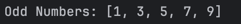
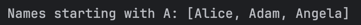
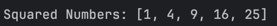
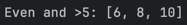
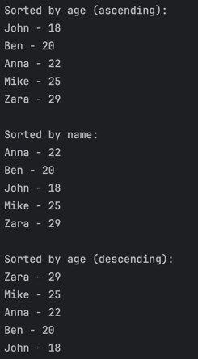

## Joana S. Tria
# Quiz 1: Java Streams: Basic Functional Programming

### Activity 1: Filter Odd Numbers

### Activity 2: Filter Strings Starting with 'A'

### Activity 3: Square All Numbers

### Activity 4: Combine Predicates

### Activity 5: Sort Objects Using Comparator

